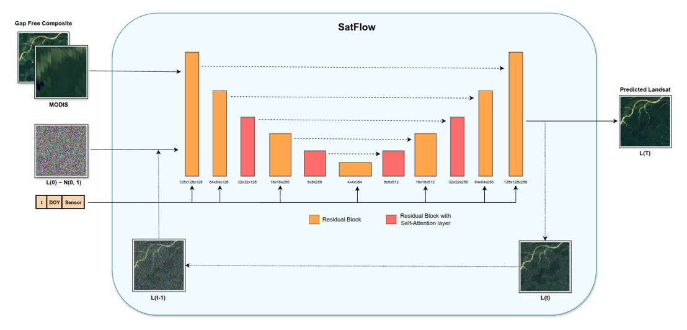
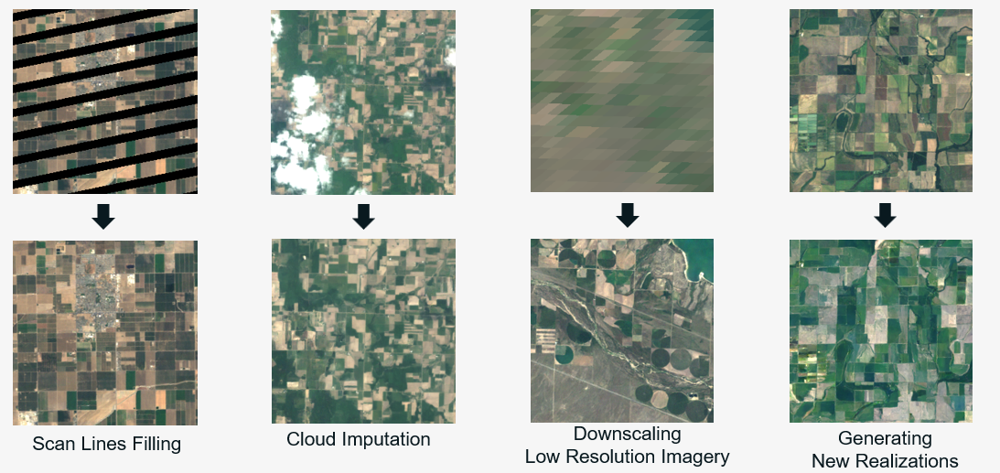
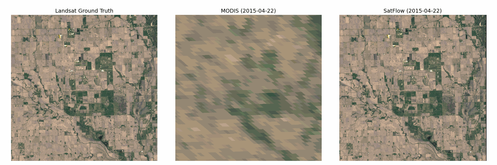

# SatFlow: Flow based Generative Model for Producing High Resolution Gap Free Remote Sensing Imagery
**Authors:** Bharath Irigireddy, Varaprasad Bandaru

**Affiliation:** USDA-ARS, Maricopa, AZ

## Abstract

High-resolution remote sensing imagery at regular intervals is crucial for agricultural and environmental monitoring, providing a knowledge base for effective decision-making. Satellites from the Landsat collection offer detailed imagery at 30m resolution but with lower temporal frequency, whereas missions such as MODIS or VIIRS provide daily coverage at lower resolutions. Clouds and cloud shadows often contaminate optical remote sensing observations, posing additional challenges. We present a deep learning model that predicts Landsat-like Surface reflectance by leveraging present-day low-resolution MODIS imagery and spatial information from previously acquired Landsat images. This method enables frequent high-resolution surface reflectance, even for periods preceding the launch of new satellites like Landsat 9 and Sentinel-2. Previously, generative models such as GANs and DDPMs have been explored for cloud removal in satellite imagery. However, Conditional Flow Matching (CFM) provides a more robust framework for training generative models by matching conditional probability paths, resulting in enhanced stability and accuracy. Our model, trained using CFM, demonstrates effectiveness in generating imagery with preserved structural and spectral integrity. Cloud removal task is regarded as image inpainting during model inference. The model treats cloud-covered areas as missing data and utilizes the learned generative processes to fill in these gaps by leveraging both MODIS and Landsat data. Predictions from our technique demonstrated lower spectral information divergence and higher Structural Similarity (SSIM) scores compared to the STARFM algorithm when evaluated across various regions in the USA. We apply our model to a study region in Nebraska, generating high-resolution, cloud-free surface reflectance at regular intervals during the agricultural crop growing season. This enabled reasonable estimation of indices like NDVI, highlighting the model's capability to deliver consistent, high-resolution data essential for effective environmental monitoring.

## Keywords
MODIS, Landsat, Gap-Filling, Conditional Flow Matching

## AGU24 Session
IN21A: Accelerating the Model-Experiment Cycle Using Artificial Intelligence and Advanced Technologies

## SatFlow Architecture

    

## Capabilities

    

## Case Study: Producing Gap Free Surface Reflectance (-96.470, 41.165)

    

